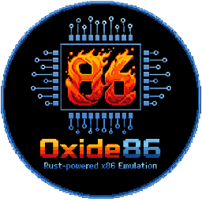
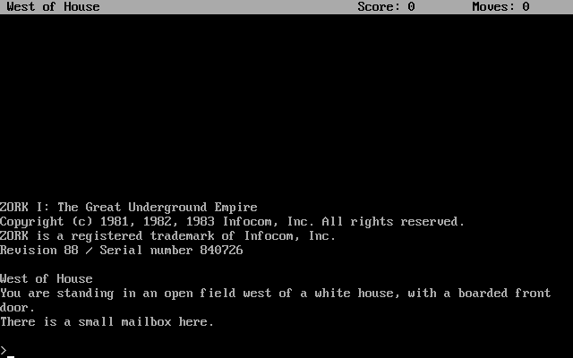
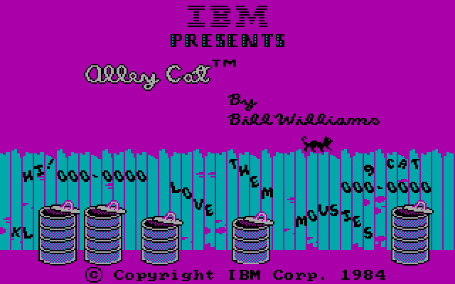
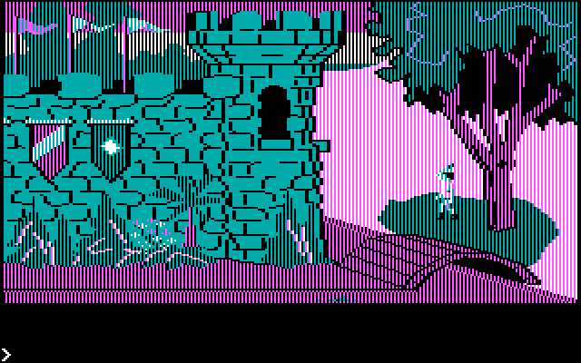
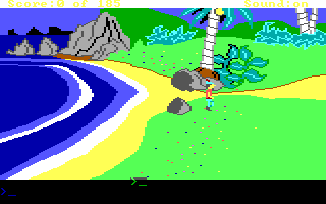
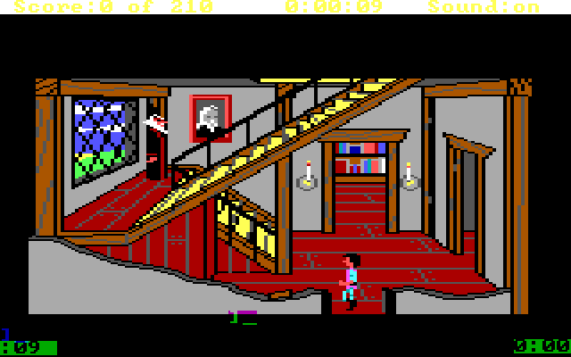
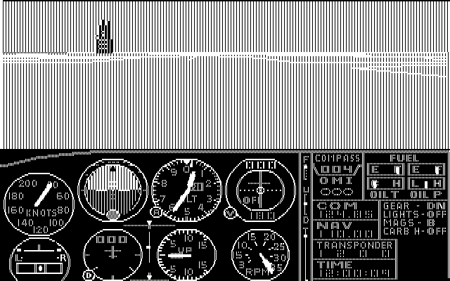
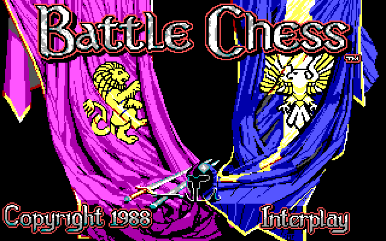
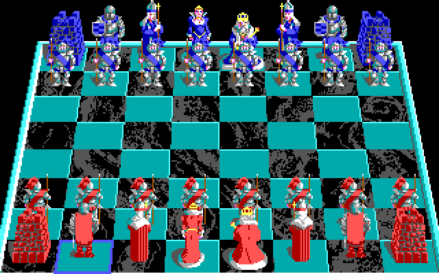
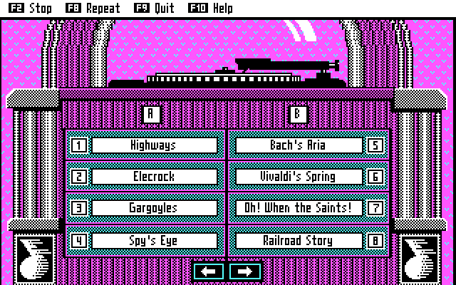

[Run Oxide86](https://oxide86.fernsroth.com)

# About

**oxide86** is an Intel x86 CPU emulator written in Rust, capable of running real MS-DOS software including early PC games and productivity applications. It supports CGA, EGA, and VGA video modes, AdLib FM sound, mouse and joystick input, floppy and hard drive images, and CD-ROM/ISO support. The emulator targets three platforms: a native CLI, a native GUI, and a WebAssembly build for the browser.

This project started in February 2026 as part of a vibe coding challenge at my company [RazorX2](https://razorx2.com/), where we wanted to see what AI-assisted development was capable of. I chose to write an x86 emulator as a stress test — something with well-defined correctness requirements, hardware-level complexity, and a long debugging tail. In hindsight it may not have been the fairest benchmark for AI, since there are plenty of existing x86 implementations out there and the models have likely learned from them. That said, adapting that knowledge to a clean Rust architecture with native and WASM targets, correct interrupt handling, and working DOS compatibility was far from trivial.

I started with Claude Opus, which produced better results, but the cost added up quickly and I switched to Claude Sonnet. Sonnet turned out to be good enough for the majority of tasks — routine implementation, bug fixes, and incremental improvements.

The process required a lot of hand-holding. The AI made plenty of mistakes — some subtle, some embarrassingly obvious — and code reviews were essential at every step. Debugging the harder issues was particularly challenging since I didn't build up a natural understanding of the code and where the problems might occur, which meant I had to reason through the emulator's behavior from the outside.

When the AI couldn't figure something out, a recurring pattern emerged: it would keep adding code rather than reasoning through the problem. Often the new code wasn't even in the execution path being hit — it was shooting in the dark, likely because the training data didn't closely match the specific problem at hand. This was most visible with deep hardware emulation issues where the AI's pattern-matching broke down entirely.

Two examples stand out. Commander Keen, after many hours of debugging sessions, still doesn't work. The AI had no clear idea where to look, and without having built up my own understanding of the project, I couldn't effectively guide it either. We were both stuck. The AdLib OPL2 implementation followed a similar arc — the AI's hand-rolled attempt was never going to be accurate enough, and eventually I had it port nuked-opl3 instead, which is a well-regarded open source implementation.

Despite that, what came out the other end is something I'm genuinely impressed by: a working emulator that boots MS-DOS, runs classic games, and plays AdLib music.

**Conclusion:** I'll continue using AI as a coding assistant — it's genuinely useful for the majority of day-to-day work. But pure vibe coding, where you hand over full control and stop following along, isn't there yet. The deeper problem is that losing your own understanding of the project creates a compounding debt. When something goes wrong in unfamiliar territory, neither you nor the AI can find solid footing, and the further you drift from understanding, the harder it becomes to course-correct. That's a problem that will only get worse as the project grows and gets more complex.

There are fundamental flaws in the emulator that no amount of incremental patching will fix. To really address them, I'd need to deep dive into understanding the x86 architecture and probably rearchitect and rewrite large parts of the code. This project exposed a core limitation of AI-assisted development: you need to understand the problem domain and make good architectural decisions upfront. You need to debug the code yourself to understand its shortcomings and figure out how to restructure it so the next issue is easier to fix. The AI will just brute-force its way to a solution — piling on workarounds and special cases — which doesn't build the kind of foundation that helps in the future.

## Lessons Learned

- **Track token and model usage from the start.** It would have been interesting to know exactly how many tokens were consumed and which models were used at each stage of the project. That data would give a much clearer picture of the real cost of AI-assisted development and help calibrate when it makes sense to reach for a more capable (and expensive) model versus a faster one.
- **Preserve the plans and prompts.** I should have kept all the planning documents and possibly all the prompts used throughout the project. They would make valuable documentation — both for understanding why certain decisions were made and as a record of how the AI-human collaboration actually unfolded in practice.
- **Write tests along the way.** I wish I had pushed the AI to write more unit tests and integration tests incrementally rather than leaving correctness entirely to manual testing. It likely would have cost more time and tokens upfront, but having a test suite would have made debugging significantly easier and given more confidence when making changes later.

# Features

### 🖥️ CPU
- Intel 8086 and 80286 instruction sets
- Accurate interrupt handling: hardware IRQs, software INTs, IRET, and flag restoration
- Programmable Interval Timer (PIT 8253/8254) with accurate cycle-based timing
- 8042 Keyboard Controller with A20 line gate support
- Interrupt Vector Table (IVT) and BIOS Data Area (BDA) fully initialized

### 🎨 Video
- **CGA**: Text (40×25, 80×25), graphics (320×200 4-color, 640×200 2-color), composite NTSC artifact color emulation
- **EGA**: 320×200 16-color (mode 0x0D) with planar memory, write modes 0 and 2, bit mask, and latch support
- **VGA**: 320×200 256-color (mode 0x13) with linear framebuffer and full DAC palette programming
- VGA DAC palette with accurate 6-bit to 8-bit color scaling; palette resets on mode change
- CGA hardware-accurate palette colors (Brown, Light Gray) matching real IBM CGA hardware and DOSBox
- Text rendering in graphics modes with opaque/transparent and XOR drawing modes

### 🔊 Audio
- **AdLib (OPL2/YM3812)**: 9-channel FM synthesis with ADSR envelopes, 4 waveforms, tremolo/vibrato LFOs, and hardware timers
- **PC Speaker**: Square-wave output driven by PIT Channel 2, with accurate frequency generation
- Native audio via Rodio; browser audio via Web Audio API AudioWorklet

### 💾 Storage
- Floppy drive images (360KB, 720KB, 1.2MB, 1.44MB) with hot-swap support
- Hard drive images with MBR partition table detection
- ATA/ATAPI interface with CD-ROM/ISO support
- FAT filesystem via fatfs with full file, directory, and handle management

### 🖱️ Input
- Mouse (COM port serial mouse protocol)
- Joystick (game port, port 0x201)
- Keyboard with scan code translation, shift state tracking, and BDA buffer management

### 🤝 DOS Compatibility
- BIOS interrupts: INT 09h, 10h, 12h, 13h, 14h, 15h, 16h, 17h, 1Ah, 20h, 21h, 28h, 29h, 2Ah, 2Fh
- INT 21h DOS services: console I/O, file operations, directories, memory allocation, process execution
- Program loader for .COM files with PSP setup; full boot sequence from floppy or hard drive

### 🌐 Platforms
- **Native CLI** 🖥️: Terminal-based output, useful for scripting and headless testing
- **Native GUI** 🪟: Hardware-accelerated rendering via wgpu; exclusive input mode with F12 to exit
- **WebAssembly** 🌍: Runs in-browser on an HTML5 Canvas with Web Audio and pointer lock support

# Getting Started

1. Download [SvarDOS 1.44M Floppy](http://svardos.org/)
2. Create a blank hard drive `dd if=/dev/zero of=hdd.img bs=1M count=32`
3. Run `cargo run -p oxide86-native-gui -- --boot --floppy-a svdos-1.44M-disk-1.img --hdd hdd.img`

## Running

In both the CLI and GUI pressing F12 will exit exclusive mode.

`
RUST_LOG=info cargo run -p oxide86-native-cli -- --boot --hdd hdd.img --boot-drive 0x80
RUST_LOG=info cargo run -p oxide86-native-gui -- --boot --hdd hdd.img --boot-drive 0x80 --com1 mouse
`

# Creating a floppy with files

```bash
# Create a blank 1.44MB image
oxide86-disktools -- format --floppy-1440 test.img

# Copy the file into the image
oxide86-disktools -- copy -i test.img my-files/* ::/
```

# Compatibility

:white_check_mark: - Tested
:hourglass: - Partially Working
:x: - Does not work

- OS
  - :white_check_mark: MS-DOS 2.11
  - :white_check_mark: MS-DOS 3.31
  - :white_check_mark: MS-DOS 4.01
  - :white_check_mark: MS-DOS 5.0
  - :white_check_mark: SvarDOS

- Games
  - :white_check_mark: Zork 1

    
  - :white_check_mark: Alley Cat

    
  - :white_check_mark: Kings Quest I

    
  - :white_check_mark: Kings Quest II

    
  - :white_check_mark: Kings Quest III

    
  - :white_check_mark: Flight Simulator 1

    
  - :white_check_mark: Battle Chess

    
    

- Other
  - :white_check_mark: AdLib Jukebox

    

# History

| Date | Title | OS Requirement | Description |
| :--- | :--- | :--- | :--- |
| 1978-06-08 | **Intel 8086 Released** | | The foundation of x86 architecture. A 16-bit processor with a 1MB address space. |
| 1979-07-01 | **Intel 8088 Released** | | A cost-effective 8086 variant with an 8-bit external bus, used in the original IBM PC. |
| 1981-08 | IBM CGA Released | | The IBM Color Graphics Adapter was the first color display standard for IBM PCs, offering 16-color, 4-color, or 2-color modes at resolutions up to 640x200 pixels. |
| 1981-08-12 | **MS-DOS 1.0** | 8088/8086 | Released alongside the IBM PC. The definitive OS for the early 16-bit generation. |
| 1982 | Intel 80186 Released | | The Intel 80186 (i186) 16-bit microprocessor was introduced as an enhanced version of the 8086 with integrated peripherals. |
| 1982-01 | **Lotus 1-2-3** | MS-DOS 1.1+ | The "killer app" for the IBM PC. Its performance on the **8088** drove business adoption. |
| 1982-02-01 | **Intel 80286 Released** | | Introduced "Protected Mode" and support for up to 16MB of RAM. |
| 1982-11 | **MS Flight Simulator 1.0** | MS-DOS 1.0+ | A legendary benchmark; if an **8088** clone could run this, it was "100% compatible." |
| 1983-03 | **MS-DOS 2.0** | 8088/8086 | Major rewrite for the PC-XT. Introduced subdirectories (folders) and hard drive support. |
| 1984-08 | **Kings Quest I** | 8088/8086 | King's Quest: Quest for the Crown (1984) is a pioneering graphical adventure game designed by Roberta Williams where players control Sir Graham |
| 1984-08 | **MS-DOS 3.0** | 80286 | Released with the PC/AT. Added support for 1.2MB high-density floppies and 32MB partitions. |
| 1984-10 | IBM EGA Released | | The Enhanced Graphics Adapter was designed as a higher-resolution successor to CGA, supporting 640x350 pixels with 16 colors from a palette of 64. |
| 1984-10 | **Alley Cat** | MS-DOS 1.1+ | A PC classic designed for the **8088**. Famous for its 4-color CGA palette and tight gameplay. |
| 1985-10-17 | **Intel 386 Released** | | First 32-bit x86 CPU. Introduced the flat memory model and hardware multitasking. |
| 1985-11-20 | **Windows 1.0** | MS-DOS 2.0+ | Microsoft’s first GUI. Required 256KB RAM; ran on **8088** but struggled without a **286**. |
| 1987-04 | **MS-DOS 3.3** | 80286/386 | The most stable early version. Added support for multiple 32MB partitions and 1.44MB floppies. |
| 1987-04-02 | **IBM VGA Released** | | Video Graphics Array; introduced the 256-color mode that defined **386/486** gaming. |
| 1987-08 | AdLib Card Released | | The AdLib Music Synthesizer Card brought FM synthesis audio to IBM PCs using the Yamaha YM3812 chip. |
| 1988-07 | **MS-DOS 4.0** | 80286/386 | Introduced the "DOS Shell" visual interface and support for hard drive partitions larger than 32MB. |
| 1988-12 | **Battle Chess** | MS-DOS 2.1+ | One of the first major titles to utilize the high-color VGA standard on **286/386** systems. |
| 1989-04-10 | **Intel 486 Released** | | Featured an integrated FPU (Math Co-processor) and L1 cache, doubling **386** performance. |
| 1989-11 | Sound Blaster Released | | Creative Labs launched the Sound Blaster, which combined AdLib compatibility with digital audio playback and recording capabilities. |
| 1990-05-22 | **Windows 3.0** | MS-DOS 3.1+ | The first massive Windows success; utilized **386** Enhanced Mode for multitasking. |
| 1990-12-14 | **Commander Keen 1-3** | MS-DOS 3.0+ | Revolutionized PC gaming with "Adaptive Tile Refresh," allowing smooth scrolling on **8088/286** PCs. |
| 1991-06 | **MS-DOS 5.0** | 80286/386/486 | Major update; allowed loading drivers into "High Memory," freeing up "Conventional Memory" for games. |
| 1991-09-17 | **Linux Kernel 0.01** | BIOS/386 | Linus Torvalds created Linux specifically to exploit the task-switching features of the **386**. |
| 1992-05-05 | **Wolfenstein 3D** | MS-DOS 3.0+ | The grandfather of FPS games; required a **286** but practically demanded a **386**. |
| 1993-03 | **MS-DOS 6.0 / 6.2** | 80386/486 | Added **DoubleSpace** disk compression and **MemMaker** for automatic RAM optimization. |
| 1993-03-22 | **Intel Pentium Released** | | The "P5" architecture. Superscalar design that could execute two instructions per clock. |
| 1993-12-10 | **DOOM** | MS-DOS 5.0+ | A cultural phenomenon. Pushed the **486** to its absolute limit with pseudo-3D rendering. |
| 1994-06 | **MS-DOS 6.22** | 80386/486 | The final standalone retail version. Replaced DoubleSpace with **DriveSpace** due to legal issues. |
| 1995-08-24 | **Windows 95** | MS-DOS 7.0 | Defined the end of the early era. Required a **386DX** but was the swan song for the **486**. |

# Miscellaneous

## Shorter logs

`cat oxide86.log | grep -v ' naga::' | grep -v 'Port 0x0064' | grep -v 'Serial I/O' | grep -v 'IVT Write' | grep -v 'oxide86_core' > oxide86.log.new; mv oxide86.log.new oxide86.log`
